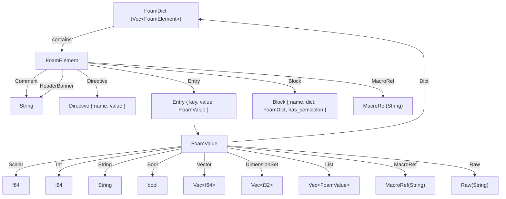
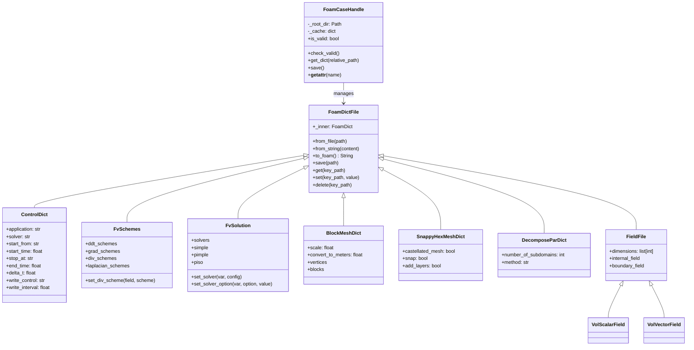

# majordome-foam

OpenFOAM dictionary parser and manipulator for the Majordome stack.

## Development builds

> For quality control, the build of all Majordome components is done with `majordome-build` script, which ensures a certain workflow. Upon running `uv sync --refresh` in a fresh version of the project, *i.e.* just cloned, the build is run automatically with default `uv` workflow. This is fine because a project should always be committed with a working build. After modifying the project, the following workflow must be enforced.

```bash
# Create the environment
uv sync --refresh

# Activate (Windows)
.venv\Scripts\activate

# Activate (Linux/Mac)
source .venv/bin/activate

# Run the build script
uv run majordome-build
```


---

## Overview and Core Goals

The primary goal of `majordome-foam` is to replace fragile regex parsers with a lossless AST parser and an intuitive Python object model.

This document outlines the architectural design and maintenance guidelines for `majordome-foam`. The project provides a Rust core parser with Python bindings (via PyO3) for parsing, manipulating, and formatting OpenFOAM dictionary files and case structures.

### Key Features

- **Lossless AST**: Preserves OpenFOAM comments (`//`, `/* */`), header banners, directives (`#include`, `#includeEtc`), macro expansion references (`$p`), and nested dictionaries.

- **Dynamic Column Alignment**: Formats output with per-level key length inspection (`max_key_len + 2` alignment) and double-newline spacing between elements.

- **Rust Core Engine**: Uses a hand-crafted lexer and recursive-descent parser in Rust for fast file I/O and low memory overhead.

- **PyO3 Bindings**: Exposes the low-level `FoamDict` AST directly to Python runtime without intermediate JSON or string conversions.

- **Case Management**: Provides `FoamCaseHandle` for automatic case validation (`constant/` and `system/controlDict`) and dynamic attribute access (`case.controlDict`, `case.fvSchemes`, `case.p`).

---

## Design Evolution and Decisions

### Initial Requirements

- Build a Python package powered by Rust following `majordome-build` conventions.

- Support OpenFOAM syntax: nested blocks (`{ ... }`), dimension sets (`[0 2 -2 0 0 0 0]`), vectors (`(0 0 0)`), scalar/integer types, string parameters, and directives.

- Provide strongly-typed Python wrapper classes (`ControlDict`, `FvSchemes`, `FvSolution`, `SnappyHexMeshDict`, `BlockMeshDict`, `DecomposeParDict`, `FieldFile`).

- Provide an integrated case handle object (`FoamCaseHandle`) to interact with valid OpenFOAM cases directly.

### Technical Decisions

- **Parser Selection**: A hand-crafted lexer (`std::iter::Peekable<Chars>`) was chosen over parser-combinator crates (`nom`/`pest`) to give fine-grained control over comment retention and header banner recognition.

- **Python Integration**: PyO3 0.28 was selected for native Rust-to-Python bindings (`pyclass`, `pymethods`).

- **Module Consolidation**: To align with a Rust-first package philosophy, all Python wrapper classes (`FoamDictFile`, `ControlDict`, `FoamCaseHandle`, etc.) are aggregated into a single `dictionaries.py` module.

---

## Rust Core AST (`src/ast.rs`)

The Abstract Syntax Tree is defined in `src/ast.rs`. It represents all OpenFOAM primitives and dictionary hierarchies.



### `FoamValue` Enum

Represents value types in OpenFOAM entries:

- `Scalar(f64)`: Floating point numbers (`0.001`, `1e-6`).

- `Int(i64)`: Signed integers (`1000`, `0`).

- `String(String)`: Plain identifiers or quoted strings (`"system"`, `ascii`).

- `Bool(bool)`: Boolean flags (`true`/`false`, `on`/`off`, `yes`/`no`).

- `Vector(Vec<f64>)`: 3D coordinate/velocity vectors `(0 0 0)`.

- `DimensionSet(Vec<i32>)`: Physical unit dimensions `[0 2 -2 0 0 0 0]`.

- `List(Vec<FoamValue>)`: Lists of values.

- `Dict(FoamDict)`: Sub-dictionaries returned during path queries.

- `MacroRef(String)`: References to other dictionary entries (`$p`).

- `Raw(String)`: Unparsed raw syntax fallback.

### `FoamElement` Enum

Represents individual statements inside a dictionary:

- `Comment(String)`: Single-line (`// ...`) or block (`/* ... */`) comments.

- `HeaderBanner(String)`: OpenFOAM standard C++ header banner block.

- `Directive { name, value }`: Directives like `#include "filename"` or `#includeEtc "filename"`.

- `Entry { key, value }`: Key-value pair (e.g. `application simpleFoam;`).

- `Block { name, dict, has_semicolon }`: Named block (e.g. `solvers { ... }`).

- `MacroRef(String)`: Top-level macro inclusion (`$includeDict;`).

### Path Traversal and Manipulation APIs

`FoamDict` provides slash-separated key path navigation (e.g., `"solvers/p/tolerance"`):

- `get_path(key_path: &str) -> Option<FoamValue>`: Recursively searches sub-blocks for keys or blocks. Returns sub-dictionaries as `FoamValue::Dict`.

- `set_path(key_path: &str, value: FoamValue)`: Traverses or constructs nested sub-blocks to assign a value.

- `delete_path(key_path: &str) -> bool`: Recursively locates and removes an entry or sub-block.

- `add_include(filename)` and `add_include_etc(filename)`: Inserts `#include` or `#includeEtc` directives at the beginning of the dictionary.

### Column Alignment and Formatting (`to_foam_indent`)

Formatting follows standard OpenFOAM layout rules:

1. **Key Length Inspection**: Finds `max_key_len` across all `Entry` keys and `Directive` names at the current dictionary level.

2. **Column Width Calculation**: Sets alignment width `align_width = max_key_len + 2`.

3. **Padded Output**: Pads each key with `" ".repeat(align_width - key.len())`, so all entry values align in the same column.

4. **Element Spacing**: Inserts a blank line (`\n\n`) between successive elements.

---

## Lexer and Parser (`src/parser.rs`)

The parser is implemented in `src/parser.rs`.

### Tokenization and Sub-Dict Recursion

- `parse_foam_dict(input: &str) -> Result<FoamDict, FoamParseError>`: Initializes a `Peekable<Chars>` iterator over input text and line counter.

- `parse_subdict(chars, line_num)`: Invoked recursively whenever a `{` token is encountered following a block identifier. Stops when matching `}` is encountered.

### Value Classification (`parse_value_str`)

Raw string values are parsed into `FoamValue` variants:

- **Booleans**: Matches `"true"`, `"on"`, `"yes"` $\rightarrow$ `Bool(true)`; `"false"`, `"off"`, `"no"` $\rightarrow$ `Bool(false)`.

- **Integers and Scalars**: Attempts `i64::parse` then `f64::parse`.

- **Vectors**: Recognizes `(x y z)` with 3 whitespace-separated numbers $\rightarrow$ `Vector(vec)`.

- **Dimension Sets**: Recognizes `[d1 d2 d3 d4 d5 d6 d7]` with integers $\rightarrow$ `DimensionSet(dims)`.

- **Macro References**: Recognizes `$name` or `${name}` $\rightarrow$ `MacroRef(name)`.

- **Quoted Strings**: Recognizes `"string"` $\rightarrow$ `String(inner)`.

---

## PyO3 Extension Interface (`src/py_dict.rs` and `src/lib.rs`)

The PyO3 binding layer is defined in `src/py_dict.rs` and registered in `src/lib.rs`.

### `PyFoamDict` Class (`#[pyclass(name = "FoamDict")]`)

Exposes `PyFoamDict` to Python as `majordome_foam.foam.FoamDict`:

- `#[new] pub fn new()`: Creates an empty `FoamDict`.

- `#[staticmethod] parse(content: &str)`: Parses dictionary text.

- `#[staticmethod] from_file(path: &str)`: Reads and parses a file from disk.

- `to_foam()`: Serializes AST back into canonical OpenFOAM format.

- `save(path)`: Writes formatted dictionary to disk.

- `get(py, key_path)`: Returns PyO3 objects (`int`, `float`, `str`, `bool`, `list`, `FoamDict`).

- `set(key_path, value)`: Converts Python object to `FoamValue` and updates AST.

- `delete(key_path)`: Deletes key path.

- Python Magic Methods: `__getitem__`, `__setitem__`, `__contains__`.

### Type Conversions

- `foam_value_to_py(py, &FoamValue)`: Maps Rust AST types to Python objects using PyO3 0.28 APIs (`into_pyobject`, `into_any().unbind()`).

- `py_to_foam_value(value: &Bound<'_, PyAny>)`: Extracts Python primitive types and maps them to `FoamValue`.

---

## Python Wrapper Architecture (`src/majordome_foam/dictionaries.py`)

All Python wrapper classes are contained in `src/majordome_foam/dictionaries.py`.



### `FoamDictFile` Base Class

Wraps PyO3 `_ext.FoamDict` and provides classmethods (`from_file`, `from_string`, `parse`), disk serialization (`save`, `to_foam`), and key path manipulation (`get`, `set`, `delete`, `contains`, `keys`, `__getitem__`, `__setitem__`).

### Specialized Dictionary Wrappers

- **`ControlDict`**: Properties for simulation controls (`application`, `solver`, `start_time`, `end_time`, `delta_t`, `write_control`, `write_interval`, `purge_write`, `write_format`, `write_precision`, `run_time_modifiable`, `adjust_time_step`, `max_co`).

- **`FvSchemes`**: Properties for discretization schemes (`ddt_schemes`, `grad_schemes`, `div_schemes`, `laplacian_schemes`, `interpolation_schemes`, `sn_grad_schemes`) and `set_div_scheme()`.

- **`FvSolution`**: Accessors for linear solvers (`solvers`), algorithm controls (`simple`, `pimple`, `piso`), relaxation factors (`relaxation_factors`), and `set_solver_option()`.

- **`BlockMeshDict`**: `scale`, `convert_to_meters`, `vertices`, `blocks`, `edges`, `boundary`.

- **`SnappyHexMeshDict`**: Execution flags (`castellated_mesh`, `snap`, `add_layers`) and control blocks (`geometry`, `castellated_mesh_controls`, `snap_controls`, `add_layers_controls`, `mesh_quality_controls`).

- **`DecomposeParDict`**: `number_of_subdomains`, `method`, `set_simple_coeffs()`.

- **`FieldFile` (`VolScalarField`, `VolVectorField`)**: Properties for `dimensions`, `internal_field`, `boundary_field`.

### `FoamCaseHandle` and `NotACaseError`

- **Case Validation**: `.is_valid` verifies that `constant/` is a directory and `system/controlDict` is a file.

- **Dynamic Lookup (`__getattr__`)**: Automatically resolves dictionary names (e.g. `case.controlDict`, `case.fvSchemes`, `case.blockMeshDict`) or field variables (e.g. `case.p`, `case.U`) by searching candidate directories (`system/`, `constant/`, `0/`, root).

- **Caching and Persistence**: Stores loaded dictionary instances in `_cache`. Calling `case.save()` writes all modified dictionaries back to disk.

---

## Maintenance and Extension Guidelines

### Adding a New OpenFOAM Dictionary Wrapper

1. Open `src/majordome_foam/dictionaries.py`.

2. Subclass `FoamDictFile`:

   ```python
   class ThermoPhysicalProperties(FoamDictFile):
       """ Interface for thermophysicalProperties dictionary. """
       __slots__ = ()

       @property
       def thermo_type(self) -> Any:
           return self.get("thermoType")
   ```

3. Register the class in `KNOWN_DICTS` inside `FoamCaseHandle`:

   ```python
   "thermophysicalProperties": (ThermoPhysicalProperties, "constant/thermophysicalProperties"),
   ```

4. Re-export the class in `__all__` in `src/majordome_foam/__init__.py`.

### Extending the Rust Parser

1. If a new syntax variant is required (e.g. specialized directive), edit `parse_value_str` or `parse_foam_dict` in `src/parser.rs`.

2. Maintain strict clippy compliance (`cargo clippy --no-deps`). Ensure no `unwrap()`, `expect()`, or `panic!()` calls exist in production paths.

3. Run `uv run pytest` to verify Python integration tests pass.

---

## Build Commands Summary

| Task | Command | Target Directory |
| :--- | :--- | :--- |
| **Rust Linting** | `cargo clippy --no-deps` | `.` |
| **Build and Install** | `uv pip install -e .` | `.` |
| **Full Build Tooling** | `uv run majordome-build` | `.` |
| **Python Unit Tests** | `uv run pytest` | `.` |
