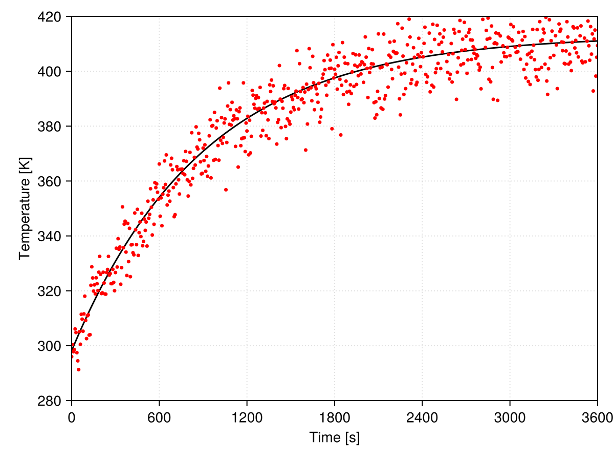

# Julia language

Julia from zero to hero (for Scientific Computing)!

**Important:** the following course may assume you are using a redistributable version of Julia packaged as described [here](https://github.com/wallytutor/julia101/tree/main). This might be useful for instructors willing to work without internet access.

## Julia 101

Welcome to Julia 101!

In this first course you will be introduced to the [Julia programming languange](https://julialang.org/). By the end of the working session (~4h) you will be able to:

- understand what is Julia and its context of usage for Scientific Computing
- the difference between an interpreted and a compiled programming language
- use Julia as a calculator and program some simple functions
- read tabular data, perform some basic operations, and plot results
- learn the path towards searching information and package documentation

Our goal in this course is not to master Julia or even pretend you have learned it; we will open the gates so that you can go out there and solve problems by yourself (or maybe open Pandora's box...).

This is probably your first time learning Julia. If you got here by other means than the main index, please consider reading the introduction of this document. Next, you can launch a terminal and try running Julia by simply typing `julia` and pressing return. For this introductory course I assume you are using [VS Code](https://code.visualstudio.com/) for which you might also wish to install the recommended extensions.

### REPL basics

Julia's REPL (read-eval-print loop) is an interactive environment where you execute code as you write. It's main goal is to manage Julia, test code snippets, get help, and launch larger chunks of code.

To enter the package manager mode press `]`m to get help for a function or module press `?`. Shell mode (system dependent) is accessed through `;`, but you are discouraged to do so here. To get back to Julia interpreted simply press backspace.

- Below we inspect the status of our environment from the package manager:

```julia-repl
(101) pkg> status
Status `D:\julia101\src\101\Project.toml`
  [13f3f980] CairoMakie v0.12.16
  [a93c6f00] DataFrames v1.7.0
  [c3e4b0f8] Pluto v0.20.3
  [6099a3de] PythonCall v0.9.23
```

- In help mode you can check how to use the `methods` function:

```julia-repl
help?> methods
search: methods Method methodswith hasmethod

  methods(f, [types], [module])

  Return the method table for f.

  If types is specified, return an array of methods whose types match. If module is specified, return an
  array of methods defined in that module. A list of modules can also be specified as an array.

  │ Julia 1.4
  │
  │  At least Julia 1.4 is required for specifying a module.

  See also: which, @which and methodswith.
```

Try by yourself and run `add Polynomials` from package manager mode (we will need it later); what do you get if you check the `status` again?

### Julia as a calculator

The following example should speak by itself:

```julia-repl
julia> 1 + 1
2

julia> 2 * 3
6

julia> 3 / 4
0.75

julia> 3 // 4
3//4

julia> 3^3
27
```

The representation of numbers in the computer is not perfect and round-off may be a problem in some cases. The most common numeric types in Julia are illustrated below with help of `typeof`.

```julia-repl
julia> typeof(1)
Int64

julia> typeof(1.0)
Float64

julia> typeof(3/4)
Float64

julia> typeof(3//4)
Rational{Int64}
```

Being a language conceived for numerical purposes, Julia has built-in support to complex numbers:

```julia-repl
julia> 1 + 1im
1 + 1im

julia> typeof(1 + 1im)
Complex{Int64}
```

Some transcendental constants are also available:

```julia-repl
julia> pi
π = 3.1415926535897...

julia> π
π = 3.1415926535897...

julia> typeof(pi)
Irrational{:π}

julia> Base.MathConstants.

catalan     e           eulergamma
eval        golden      include
pi          γ           π
φ           ℯ

julia> Base.MathConstants.e
ℯ = 2.7182818284590...

julia> names(MathConstants)
10-element Vector{Symbol}:
 :MathConstants
 :catalan
 :e
 :eulergamma
 :golden
 :pi
 :γ
 :π
 :φ
 :ℯ
```

In some cases type conversion is handled automatically:

```julia-repl
julia> 1 + 2.0
3.0
```

Trigonometric functions are also supported:

```julia-repl
julia> sin(π/2)
1.0

julia> cos(π/2)
6.123233995736766e-17

julia> tan(π/2)
1.633123935319537e16
```

And also inverse trigonometric functions:

```julia-repl
julia> asin(0)
0.0

julia> acos(0)
1.5707963267948966

julia> atan(Inf)
1.5707963267948966
```

Hyperbolic functions are not surprisingly built-in:

```julia-repl
julia> sinh(1)
1.1752011936438014
```

Because of how floating point representation works, one must take care when performing equality comparisons:

```julia-repl
julia> acos(0) == pi/2
true

julia> sin(2π / 3) == √3 / 2
false
```

Testing for *approximately equal* is a better practice here:

```julia-repl
julia> sin(2π / 3) ≈ √3 / 2
true

julia> isapprox(sin(2π / 3), √3 / 2)
true

julia> isapprox(sin(2π / 3), √3 / 2; atol=1.0e-16)
false
```

The smallest number you can *add to 1 and get a different result* is often called the [machine epsilon](https://en.wikipedia.org/wiki/Machine_epsilon) (although there are more formal definitions). It is a direct consequence of floating point representation and is somewhat related to the above:

```julia-repl
julia> 1 + eps()/2
1.0

julia> 1 + eps()
1.0000000000000002
```

### Vectors and matrices

Let's start once again with no words:

```julia-repl
julia> b = [5, 6]
2-element Vector{Int64}:
 5
 6

julia> A = [1.0 2.0; 3.0 4.0]
2×2 Matrix{Float64}:
 1.0  2.0
 3.0  4.0

julia> x = A \ b
2-element Vector{Float64}:
 -3.9999999999999987
  4.499999999999999

julia> A * x ≈ b
true
```

If you try to perform vector-vector multiplication you get an error:

```julia-repl
julia> b * b
ERROR: MethodError: no method matching *(::Vector{Int64}, ::Vector{Int64})
The function `*` exists, but no method is defined for this combination of argument types.
```

That should be obvious because multiplying a pair of row-vectors makes no sense (in Python NumPy would allow that mathematical horror); in Julia we make things more formally by transposing the first vector to get a column-row pair:

```julia-repl
julia> b' * b
61
```

Element-wise multiplication can also be achieved with `.*` (same is valid for other operators):

```julia-repl
julia> b .* b
2-element Vector{Int64}:
 25
 36
```

There are a few ways to create equally spaced vectors that might be useful:

```julia-repl
julia> 0:1.0:100
0.0:1.0:100.0

julia> collect(0:1.0:100)'
1×101 adjoint(::Vector{Float64}) with eltype Float64:
 0.0  1.0  2.0  3.0  4.0  5.0  6.0  7.0  8.0  9.0  10.0  …  93.0  94.0  95.0  96.0  97.0  98.0  99.0  100.0

julia> LinRange(0, 100, 101)
101-element LinRange{Float64, Int64}:
 0.0, 1.0, 2.0, 3.0, 4.0, 5.0, 6.0, 7.0, 8.0, 9.0, 10.0, …, 93.0, 94.0, 95.0, 96.0, 97.0, 98.0, 99.0, 100.0
```

### Representing text

The uninformed think the numerical people need not to know how to manipulate text; that is completely wrong. An important amount of time in the conception of a simulation code or data analysis is simply *string* manipulation.

In Julia we use double quotes to enclose strings and single quotes for characters. Let's see a few examples:

```julia-repl
julia> "Some text here"
"Some text here"

julia> println("Some text here")
Some text here

julia> print("Some text here")
Some text here
julia>
```

During a calculation, to write the value of a variable to the standard output one might do the following:

```julia-repl
julia> x = 2.3
2.3

julia> println("The value of x = $(x)")
The value of x = 2.3

julia> @info("""
             Strings may be composed of several lines!

             You can also display the value of x = $(x)
             """)
┌ Info: Strings may be composed of several lines!
│
└ You can also display the value of x = 2.3
```

### Tuples and dictionaries

Tuples are immutable data containers; they consist *their own type*.

```julia-repl
julia> t = ("x", 1)
("x", 1)

julia> typeof(t)
Tuple{String, Int64}
```

A *variant* called `NamedTuple` is also available in Julia:

```julia-repl
julia> t = (variable = "x", value = 1)
("x", 1)

julia> typeof(t)
@NamedTuple{variable::String, value::Int64}
```

On the other hand, dictionaries are mutable mappings:

```julia-repl
julia> X = Dict("CH4" => 0.95, "CO2" => 0.03)
Dict{String, Float64} with 2 entries:
  "CH4" => 0.95
  "CO2" => 0.03

julia> sum(values(X))
0.98

julia> X["N2"] = 1.0 - sum(values(X))
0.020000000000000018

julia> X
Dict{String, Float64} with 3 entries:
  "CH4" => 0.95
  "CO2" => 0.03
  "N2"  => 0.02
```

### A first function

A function can be created in a single line:

```julia-repl
julia> normal(x) = (1 / sqrt(2pi)) * exp(-x^2/2)
normal (generic function with 1 method)

julia> normal(1)
0.24197072451914337

julia> normal(3)
0.0044318484119380075
```

The same name can be used to create different interfaces thanks to [multiple dispatch](https://en.wikipedia.org/wiki/Multiple_dispatch):

```julia-repl
julia> normal(x, mu, sigma) =
           exp(-(x - mu)^2 / (2 * sigma^2)) /
           sqrt(2pi * sigma)
normal (generic function with 2 methods)

julia> normal(3, 0, 1)
0.0044318484119380075
```

For larger functions using the keyword `function` is the way to go; notice below the introduction of optional keyword arguments after the semicolon:

```julia-repl
julia> function normal(x; mu = 0, sigma = 1)
           return exp(-(x - mu)^2 / (2 * sigma^2)) / sqrt(2pi * sigma)
       end
normal (generic function with 2 methods)

julia> normal(3)
0.0044318484119380075
```

Notice that a better alternative in this case would be to wrap the 3-argument version of `normal` in the key-word interface as follows:

```julia-repl
julia> normal(x; mu = 0, sigma = 1) = normal(x, mu, sigma)
normal (generic function with 2 methods)

julia> normal(3)
0.0044318484119380075
```

To identify the possible interfaces of a given function, one can inspect its `methods`:

```julia-repl
julia> methods(normal)
# 2 methods for generic function "normal" from Main:
 [1] normal(x; mu, sigma)
     @ REPL[108]:1
 [2] normal(x, mu, sigma)
     @ REPL[106]:1
```

The *macro* `@which` provides the functionality for a given function call:

```julia-repl
julia> @which normal(3)
normal(x; mu, sigma)
     @ Main REPL[108]:1
```

### Using modules

One can import all functionalities from a given module with `using ModuleName`; that is generally not what we want in complex programs (because of name clashes). If only a few functionalities of a given module will be used, then proceed as follows:

```julia-repl
julia> using Statistics: mean

julia> mean(rand(10))
0.4922029043061601

julia> mean(rand(100))
0.5081883767210799

julia> mean(rand(1000))
0.5176285712019737
```

Alias imports are also supported:

```julia-repl
julia> import Statistics as ST

julia> ST.mean(rand(1000))
0.5123135802316784
```

By the way, we used built-in random number generation in the above example.

### Calling Python

```julia-repl
julia> using PythonCall
    CondaPkg Found dependencies: D:\julia101\src\101\CondaPkg.toml
    CondaPkg Found dependencies: D:\julia101\bin\julia-1.11.1-win64\depot\packages\PythonCall\Nr75f\CondaPkg.toml
    CondaPkg Dependencies already up to date

julia> ct = pyimport("cantera")
Python: <module 'cantera' from 'D:\\julia101\\bin\\julia-1.11.1-win64\\CondaPkg\\Lib\\site-packages\\cantera\\__init__.py'>

julia> gas = ct.Solution("gri30.yaml")
Python: <cantera.composite.Solution object at 0x000001659DFC4510>

julia> gas.TPX = 1000, ct.one_atm, "CH4: 1.0, O2: 2.0"
(1000, <py 101325.0>, "CH4: 1.0, O2: 2.0")

julia> gas.equilibrate("HP")
Python: None

julia> println(gas.report())

  gri30:

       temperature   3126.8 K
          pressure   1.0132e+05 Pa
           density   0.080809 kg/m^3
  mean mol. weight   20.734 kg/kmol
   phase of matter   gas

                          1 kg             1 kmol
                     ---------------   ---------------
          enthalpy        1.1826e+05        2.4519e+06  J
   internal energy       -1.1356e+06       -2.3546e+07  J
           entropy             13721         2.845e+05  J/K
    Gibbs function       -4.2786e+07       -8.8711e+08  J
 heat capacity c_p            2171.8             45029  J/K
 heat capacity c_v            1770.8             36715  J/K

                      mass frac. Y      mole frac. X     chem. pot. / RT
                     ---------------   ---------------   ---------------
                H2         0.0078306          0.080534           -23.513
                 H         0.0031683          0.065169           -11.757
                 O          0.039194          0.050793           -16.443
                O2           0.13498          0.087465           -32.886
                OH          0.085304             0.104             -28.2
               H2O           0.30666           0.35294           -39.956
               HO2        8.2121e-05        5.1586e-05           -44.643
              H2O2        3.5871e-06        2.1865e-06           -56.399
                 C        2.5216e-11        4.3529e-11           -18.927
                CH        2.8497e-12        4.5383e-12           -30.684
               CH2        1.5294e-12        2.2607e-12            -42.44
            CH2(S)        1.6465e-13        2.4338e-13            -42.44
               CH3         1.086e-12        1.4977e-12           -54.197
               CH4         9.411e-14        1.2163e-13           -65.953
                CO           0.22248           0.16468            -35.37
               CO2           0.20029          0.094361           -51.813
               HCO        1.0254e-06        7.3267e-07           -47.127
              CH2O        7.9233e-09        5.4713e-09           -58.883
             CH2OH        5.3103e-13        3.5478e-13            -70.64
              HCCO        2.3319e-14        1.1784e-14           -66.054
     [  +33 minor]        3.0931e-14        1.9711e-14
```

### Things to learn

- Regular expressions and text parsing
- Annotating types in functions
- Defining [structures](https://www.youtube.com/watch?v=e5_PUNZdDsQ&list=PLhQ2JMBcfAsiu2BjeDuj0OXxD1Or_FjID&index=16) and type-based dispatch
- Flow control (loops, if-else statements, etc.)
    - [if Expression (if...elseif...else...end)](https://www.youtube.com/watch?v=6d8YheLvO-I&list=PLhQ2JMBcfAsiu2BjeDuj0OXxD1Or_FjID&index=17)
    - [While Loop (while...end)](https://www.youtube.com/watch?v=6ujWpbQZX4s&list=PLhQ2JMBcfAsiu2BjeDuj0OXxD1Or_FjID&index=20)
    - [For Loop (for...end)](https://www.youtube.com/watch?v=4cg9UuG2G4g&list=PLhQ2JMBcfAsiu2BjeDuj0OXxD1Or_FjID&index=20)
    - [For Loop over collection](https://www.youtube.com/watch?v=2ixUMtFttsI&list=PLhQ2JMBcfAsiu2BjeDuj0OXxD1Or_FjID&index=21)

### Pluto environment

Before going further, learn some Markdown! Please notice that Markdown has no standard and not all of GitHub's markdown works in Pluto (although most of it will be just fine). Here you find some recommendations:

- [GitHub Markdown](https://docs.github.com/en/get-started/writing-on-github/getting-started-with-writing-and-formatting-on-github/basic-writing-and-formatting-syntax)
- [Julia Markdown](https://docs.julialang.org/en/v1/stdlib/Markdown/)

For entering equations, Julia Markdown supports LaTeX typesetting; you can learn some of it [here](https://www.overleaf.com/learn/latex/Mathematical_expressions) but we won't enter in the details during this session.

Also notice that you can enter variable names in [Unicode](https://docs.julialang.org/en/v1/manual/unicode-input/). This helps keeping consistency between mathematical formulation and code, what is pretty interesting. Please do not use Unicode mixed with LaTeX (only Pluto supports that), otherwise you won't be able to copy your equations directly to reports. Partial support of autocompletion works in Pluto for Unicode, simply write a backslash and press tab, a list of available names will be shown.

Generally speaking, you should follow its [documentation](https://plutojl.org/) to run Pluto, *i.e.* `using Pluto; Pluto.run()`. In some cases because of local system configuration that might fail. Some corporate browsers will not be able to access `localhost` and [configuring](https://plutojl.org/en/docs/configuration/) Pluto might be required. The following snippet provides a `pluto` function that could be useful in those cases:

```julia
using Pluto

function pluto(; port = 2505)
    session = Pluto.ServerSession()
    session.options.server.launch_browser = false
    session.options.server.port = port
    session.options.server.root_url = "http://127.0.0.1:$(port)/"
    Pluto.run(session)
end
```

Your task:

- Read `media/newton_cooling.dat` as a data frame
- Clean data as required and establish a proper visualization
- Propose a model to fit the data and identify a package to find its parameters

Your tools:

- [DataFrames](https://dataframes.juliadata.org/stable/)
- [Makie](https://docs.makie.org/v0.21/)
- What else do you need?

Your goal:



### Going further

- [Julia Documentation](https://docs.julialang.org/en/v1/): in this page you find the whole documentation of Julia.

    - Generally after taking this short course you should be able to navigate and understand a good part of the [Manual](https://docs.julialang.org/en/v1/manual/getting-started/).

    - It is also interesting to check-out [Base](https://docs.julialang.org/en/v1/base/base/) to explore what is built-in to Julia and avoid reinventing the wheel!

    - Notice that not everything *built-in* to Julia is available under `Base` and some functionalities are available in the [Standard Library](https://docs.julialang.org/en/v1/stdlib/ArgTools/) which consists of *built-in* packages that are shipped with Julia.

- [Julia Academy](https://juliaacademy.com/): you can find a few courses conceived by important Julia community members in this page. The [Introduction to Julia](https://juliaacademy.com/p/intro-to-julia) is a longer version of what you learned here.

- [Python](https://www.python.org/): Julia does not replace Python (yet) because it is much younger. We have seen how to call Python from Julia and the computational scientist should be well versed in both languages as of today.

- [Julia Packages](https://juliapackages.com/): the ecosystem of Julia is reaching a good maturity level and you can explore it to find packages suiting your needs in this page.

- [Exercism Julia Track](https://exercism.org/tracks/julia): this page proposes learning through exercises, it is good starting point to get the fundamentals of algorithmic thinking.

- [Julia Data Science](https://juliadatascience.io/): a very straightforward book on Data Science in Julia; you can learn more about tabular data and review some plotting with Makie here.

- [Introduction to Computational Thinking](https://computationalthinking.mit.edu/Fall24/): this MIT course by Julia's creator [Dr. Alan Edelman](https://math.mit.edu/~edelman/) gives an excellent overview of how powerful the language can be in several scientific domains.

- [SciML Book](https://book.sciml.ai/): this course enters more avanced topics and might be interesting as a final learning resource for those into applied mathematics and numerical simulation.

- [JuliaHub](https://juliahub.com/): this company proposes a cloud platform (non-free) for performing computations with Julia. In its page you find a few useful and good quality learning materials.

### A few Julia organizations

- [SciML](https://sciml.ai/): don't be tricked by its name, its field of application goes way beyond what we understand by Machine Learning. SciML is probably the best curated set of open source scientific tools out there. Take a look at the list of available packages [here](https://docs.sciml.ai/Overview/stable/overview/). This last link is probably the best place to search for a generic package for Scientific Computing.

- [JuMP](https://jump.dev/): it is a *modeling language* for optimization problems inside Julia. It is known to work well with several SciML packages and allows to state problems in a readable way. Its documentation has its own [Getting started with Julia](https://jump.dev/JuMP.jl/stable/tutorials/getting_started/getting_started_with_julia/) that you may use to review this module.

- [JuliaData](https://github.com/JuliaData): all about tabular data and related manipulations. The parents of [DataFrames.jl](https://dataframes.juliadata.org/stable/).

- [Julia Math](https://github.com/JuliaMath): several math-related packages. Most basic users coming from *spreadsheet hell* might be interested in [Polynomials.jl](https://juliamath.github.io/Polynomials.jl/stable/) from this family.

- [JuliaMolsim](https://juliamolsim.github.io/): molecular simulation in Julia, from DFT to Molecular dynamics.

### Getting help in the wild

- [Julialang Discourse](https://discourse.julialang.org/): instead of Stackoverflow, most Julia discussion threads are hosted in this page.

- [Zulipchat Julialang](https://julialang.zulipchat.com/): some discussion (specially regarding development) is hold at Zulipchat.

## Julia 102

Hello again! Hope you have enjoyed *Julia 101*!

This second course of the series will extend your Julia skills to the next level. In the previous session we have focused on using Julia from the REPL, but that's not how things work in the *real world*. Now we move towards creating reusable code, packaging it, and calling it from elsewhere. This will include the following topics:

- Types and structures
- Functions and multiple dispatch
- Wrapping up code in modules
- Creating a package

### User-defined types

### Writing your own functions

### Creating reusable modules

### Packaging code

## Julia 201

Hello again! Hope you have enjoyed *Julia 102*!

Let's go straight to what matters, the topics discussed here:

- Performance and benchmarking
- Linear algebra and vectorization
- Interoperability with C and Fortran

## Julia 202

Hello again! Hope you have enjoyed *Julia 201*!

Let's go straight to what matters, the topics discussed here:

- Multi-threading and multi-processing
- GPU programming
- Metaprogramming


### Multi-threading

```python
versioninfo()
```

### Multi-processing


### Metaprogramming


### Recommended contents

- [(08x03) Intro to Julia Multi-Threading | How to use the Threads.@threads macro](https://www.youtube.com/watch?v=kX6_iY_BtG8&list=PLhQ2JMBcfAsjQzwp2j97uZjNOMi7Ed4CG&index=3)
- [(08x04) Intro to Julia Multi-Processing (It's not the same as Multi-Threading!)](https://www.youtube.com/watch?v=uKdpY6Je6Oc&list=PLhQ2JMBcfAsjQzwp2j97uZjNOMi7Ed4CG&index=4)
- [(06x10) High-Level, Conceptual Introduction to Julia GPGPU using CUDA.jl (CUDA.jl 101 Part 1 of 3)](https://www.youtube.com/watch?v=VpbMiCG2Tz0&list=PLhQ2JMBcfAshxbsVbBDY6pj3K41XzdJDy&index=3)
- [(06x11) How to Write CUDA Kernels and Use CUDA Libraries using CUDA.jl (CUDA.jl 101 Part 2 of 3)](https://www.youtube.com/watch?v=YwHGnHI5UxA&list=PLhQ2JMBcfAshxbsVbBDY6pj3K41XzdJDy&index=4)
- [(06x12) How to use your GPU for Machine Learning using CUDA.jl and Flux.jl (CUDA.jl 101 Part 3 of 3)](https://www.youtube.com/watch?v=4PmcxUKSRww&list=PLhQ2JMBcfAshxbsVbBDY6pj3K41XzdJDy&index=5)

## Selected Julia packages

### General

- [Julia Programming](https://docs.julialang.org/en/v1/)
- [Graphs.jl](https://juliagraphs.org/Graphs.jl/dev/)
- [Mustache.jl](https://jverzani.github.io/Mustache.jl/dev/)
- [PackageCompiler.jl](https://julialang.github.io/PackageCompiler.jl/stable/index.html)
- [Revise.jl](https://timholy.github.io/Revise.jl/stable/)

### Plotting and graphics

- [Makie.jl](https://docs.makie.org/stable/)
- [Plots.jl](https://docs.juliaplots.org/stable/)
- [Winston.jl](https://winston.readthedocs.io/en/latest/)
- [Luxor.jl](https://juliagraphics.github.io/Luxor.jl/stable/)

### Numerical methods

- [Ferrite.jl](https://ferrite-fem.github.io/Ferrite.jl/stable/)
- [Kinetic.jl](https://xiaotianbai.com/Kinetic.jl/dev/)
- [ModelingToolkit.jl](https://docs.sciml.ai/ModelingToolkit/stable/)
- [Roots.jl](https://juliamath.github.io/Roots.jl/stable/)
- [Symbolics.jl](https://symbolics.juliasymbolics.org/stable/)
- [VoronoiFVM.jl](https://j-fu.github.io/VoronoiFVM.jl/dev/)

### Kinetics and Thermodynamics

- [Catalyst.jl](https://docs.sciml.ai/Catalyst/stable/)
- [Clapeyron.jl](https://clapeyronthermo.github.io/Clapeyron.jl/dev/)
- [DFTK.jl](https://docs.dftk.org/stable/)
- [SteamTables.jl](https://github.com/braamvandyk/SteamTables.jl)

### Machine learning

- [Flux.jl](https://fluxml.ai/Flux.jl/stable/)
- [Lux.jl](https://lux.csail.mit.edu/)
- [NeuralPDE.jl](https://docs.sciml.ai/NeuralPDE/stable/)
- [Zygote.jl](https://fluxml.ai/Zygote.jl/stable/)

### GPU Programming

- [CUDA.jl](https://cuda.juliagpu.org/stable/)
- [Adapt.jl](https://github.com/JuliaGPU/Adapt.jl)

## Plotting in Julia

*Upcoming...*
